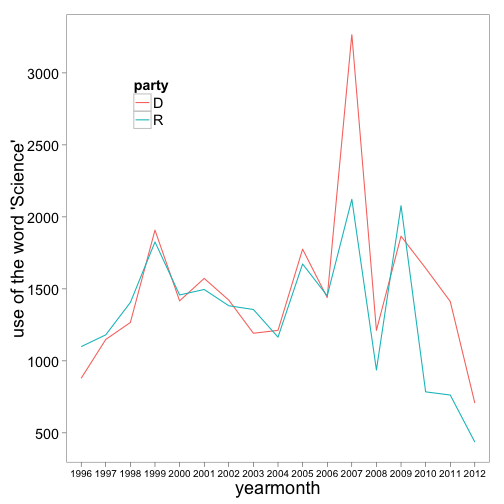

*********

I created an R package a while back to interact with some APIs that serve up data on what our elected represenatives are up to, including the [New York Times Congress API](http://developer.nytimes.com/), and the [Sunlight Labs API](http://services.sunlightlabs.com/).

What kinds of things can you do with `govdat`?  Here are a few examples. 

*********

### How do the two major parties differ in the use of certain words (searches the congressional record using the Sunlight Labs Capitol Words API)?

```r
# install_github('govdat', 'schamberlain')
library(govdat)
library(reshape2)
library(ggplot2)

dems <- sll_cw_dates(phrase = "science", start_date = "1996-01-20", end_date = "2012-09-01", 
    granularity = "year", party = "D", printdf = TRUE)
repubs <- sll_cw_dates(phrase = "science", start_date = "1996-01-20", end_date = "2012-09-01", 
    granularity = "year", party = "R", printdf = TRUE)
df <- melt(rbind(data.frame(party = rep("D", nrow(dems)), dems), data.frame(party = rep("R", 
    nrow(repubs)), repubs)))
df$count <- as.numeric(df$count)

ggplot(df, aes(yearmonth, count, colour = party, group = party)) + geom_line() + 
    labs(y = "use of the word 'Science'") + theme_bw(base_size = 18) + opts(axis.text.x = theme_text(size = 10), 
    panel.grid.major = theme_blank(), panel.grid.minor = theme_blank(), legend.position = c(0.2, 
        0.8))
```

 


*********

### How do the two major parties differ in their 

```r
library(plyr)

# Let's get Nancy Pelosi's entity ID
sll_ts_aggregatesearch('Nancy Pelosi')[[1]]
```

```
$name
[1] "Nancy Pelosi (D)"

$count_given
[1] 0

$firm_income
[1] 0

$count_lobbied
[1] 0

$seat
[1] "federal:senate"

$total_received
[1] 17197286

$state
[1] "WY"

$lobbying_firm
NULL

$count_received
[1] 11742

$party
[1] "R"

$total_given
[1] 0

$type
[1] "politician"

$id
[1] "85ab2e74589a414495d18cc7a9233981"

$non_firm_spending
[1] 0

$is_superpac
NULL

```

```r

# Her entity ID
sll_ts_aggregatesearch('Nancy Pelosi')[[1]]$id
```

```
[1] "85ab2e74589a414495d18cc7a9233981"
```

```r

# And search for her top donors by sector
nancy <- ldply(sll_ts_aggregatetopsectors(sll_ts_aggregatesearch('Nancy Pelosi')[[1]]$id))
nancy # but just abbreviations for sectors
```

```
   sector count     amount
1       P  1386 3263050.00
2       F  2148 3192072.00
3       H  1253 2086900.00
4       Q  1300 1529571.00
5       K  1411 1502517.00
6       N   926 1343187.00
7       B   712 1211544.00
8       W   759  817550.00
9       Y   822  666926.00
10      E   253  363539.00
```

```r
data(sll_ts_sectors) # load sectors abbrevations data
nancy2 <- merge(nancy, sll_ts_sectors, by="sector") # attach full sector names
nancy2_melt <- melt(nancy2[,-1], id.vars=3)
nancy2_melt$value <- as.numeric(nancy2_melt$value)
ggplot(nancy2_melt, aes(sector_name, value)) + # and lets plot some results
	geom_bar() +
	coord_flip() +
	facet_wrap(~ variable, scales="free", ncol=1)
```

 

```r

## It looks like a lot of individual donations (the count facet) by finance/insurance/realestate, but by amount, the most (by slim margin) is from labor organizations.
```


*********

### Or we may want to get a bio of a congressperson. Here we get Jeanne Shaheen of NH. And some twitter searching too? Indeed.

```r
out <- nyt_cg_memberbioroles("A000358")  # cool, lots of info, output cutoff for brevity
out[[3]][[1]][1:2]
```

```
$member_id
[1] "A000358"

$first_name
[1] "Todd"

```

```r

# we can get her twitter id from this bio, and search twitter using
# twitteR package
akintwitter <- out[[3]][[1]]$twitter_id

# install.packages('twitteR')
library(twitteR)
tweets <- userTimeline(akintwitter, n = 100)
tweets[1:5]  # there's some gems in there no doubt
```

```
[[1]]
[1] "RepToddAkin: Do you receive my Akin Alert e-newsletter?  Pick the issues you’d like to get updates on and sign up here!\nhttp://t.co/nZfiRjTF"

[[2]]
[1] "RepToddAkin: If the 2001 &amp; 2003 tax policies expire, taxes will increase over $4 trillion in the next 10 years. America can't afford it. #stopthetaxhike"

[[3]]
[1] "RepToddAkin: A govt agency's order shouldn't defy constitutional rights. I'm still working for #religiousfreedom and repealing the HHS mandate. #prolife"

[[4]]
[1] "RepToddAkin: I am a cosponsor of the bill being considered today to limit abortions in DC. RT if you agree! #prolife http://t.co/Mesrjl0w"

[[5]]
[1] "RepToddAkin: We need to #StopTheTaxHike. Raising taxes like the President wants would destroy more than 700,000 jobs. #4jobs http://t.co/KUTd0M7U"

```


*********

### Get the .Rmd file used to create this post [at my github account](https://github.com/SChamberlain/schamberlain.github.com/blob/master/_drafts/2012-09-01-govdat.Rmd).

*********

### Written in [Markdown](http://daringfireball.net/projects/markdown/), with help from [knitr](http://yihui.name/knitr/), and nice knitr highlighting/etc. in in [RStudio](http://rstudio.org/).
