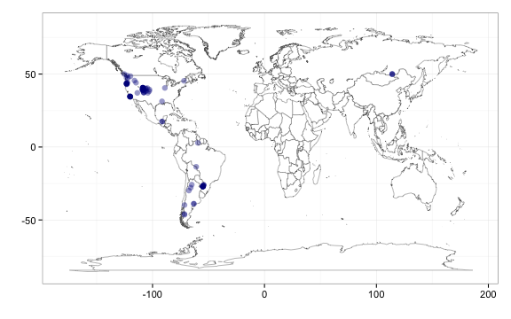
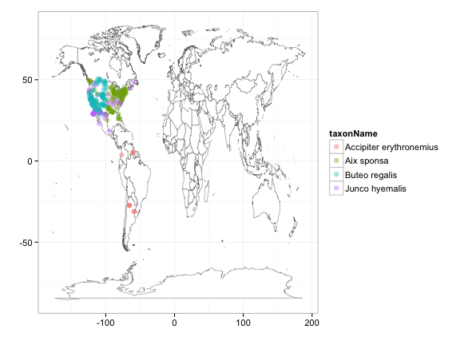
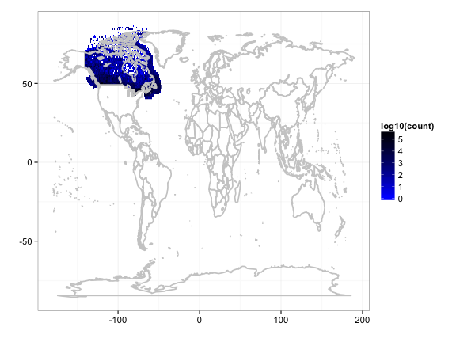
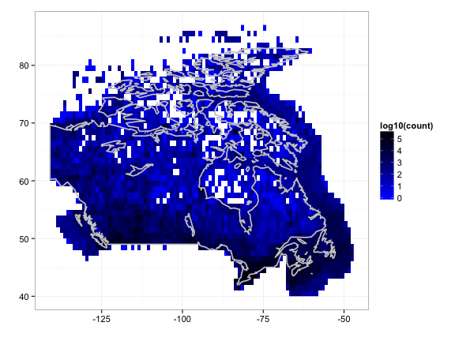

---
name: rgbif-newfxns
layout: post
title: GBIF biodiversity data from R - more functions
date: 2012-10-08
author: Scott Chamberlain
tags: 
- R
- open access
- data
- GBIF
- biodiversity
- macroecology
---

We have been working on an R package to get GBIF data from R, with the stable version available through CRAN [here](URL), and the development version available on GitHub [here](http://github.com/rgbif). 

We had a Google Summer of code stuent work on the package this summer - you can see his work on the package over at his GitHub page [here]().  We have added some new functionality since his work, and would like to show it off. 

### Lets install rgbif first.

```r
# install_github('rgbif', 'ropensci') # uncomment if not already installed
library(rgbif)
library(plyr)
library(XML)
library(httr)
```


### Get taxonomic information on a specific taxon or taxa in GBIF by their taxon concept keys.

```r
(keys <- taxonsearch(scientificname = "Puma concolor"))  # many matches to this search
```

```
 [1] "51780668" "51758018" "50010499" "51773067" "51078815" "51798065"
 [7] "51088007" "50410780" "50305290" "51791438"
```

```r
taxonget(keys[[1]])  # let's get the first one - the first row in the data.frame is the one we searched for (51780668)
```

```
[[1]]
                    sciname gbifkeys       rank
1             Puma concolor 51780668    species
2                      Puma 51780667      genus
3                   Felidae 51780651     family
4                 Carnivora 51780613      order
5                  Mammalia 51780547      class
6                  Chordata 51775774     phylum
7                  Animalia 51775773    kingdom
8 Puma concolor californica 51780669 subspecies
9   Puma concolor improcera 51780670 subspecies

```


### The `occurrencedensity` function was renamed to `densitylist` because it is in the `density` API service, not the `occurrence` API service.  You can use `densitylist` to get a data.frame of total occurrence counts by one-degree cell for a single taxon, country, dataset, data publisher or data network.  Just a quick reminder of what the function can do:

```r
head(densitylist(originisocountrycode = "CA"))
```

```
  cellid minLatitude maxLatitude minLongitude maxLongitude count
1  46913          40          41          -67          -66    44
2  46914          40          41          -66          -65   907
3  46915          40          41          -65          -64   510
4  46916          40          41          -64          -63   645
5  46917          40          41          -63          -62    56
6  46918          40          41          -62          -61   143
```


### Using a related function, `density_spplist`, you can get a species list by one-degree cell as well.

```r
# Get a species list by cell, choosing one at random
density_spplist(originisocountrycode = "CO", spplist = "random")[1:10]
```

```
 [1] "Gonichthys cocco" "Oreopanax"        NA                
 [4] NA                 NA                 NA                
 [7] NA                 NA                 NA                
[10] NA                
```

```r
# density_spplist(originisocountrycode = 'CO', spplist = 'r') # can
# abbreviate the `spplist` argument

# Get a species list by cell, choosing the one with the greatest no. of
# records
density_spplist(originisocountrycode = "CO", spplist = "great")[1:10]  # great is abbreviated from `greatest`
```

```
 [1] "Acanthaceae Juss."                
 [2] "Accipitridae sp."                 
 [3] "Accipitriformes/Falconiformes sp."
 [4] "Apodidae sp."                     
 [5] "Apodidae sp. (large swift sp.)"   
 [6] "Apodidae sp. (small swift sp.)"   
 [7] "Arctiinae"                        
 [8] "Asteraceae Bercht. & J. Presl"    
 [9] "Asteraceae sp. 1"                 
[10] "Asteraceae sp. 6"                 
```

```r

# Can also get a data.frame with counts instead of the species list
density_spplist(originisocountrycode = "CO", spplist = "great", listcount = "counts")[1:10, 
    ]
```

```
                              names_ count
1                  Acanthaceae Juss.     2
2                   Accipitridae sp.     6
3  Accipitriformes/Falconiformes sp.     2
4                       Apodidae sp.     5
5     Apodidae sp. (large swift sp.)     8
6     Apodidae sp. (small swift sp.)     5
7                          Arctiinae     7
8      Asteraceae Bercht. & J. Presl     2
9                   Asteraceae sp. 1     6
10                  Asteraceae sp. 6    10
```


### You can now map point results, from fxns `occurrencelist` and those from `densitylist`, which plots them as points or as tiles, respectively. 

```r
# Point map, using output from occurrencelist
out <- occurrencelist(scientificname = "Puma concolor", coordinatestatus = TRUE, 
    maxresults = 100, latlongdf = T)
gbifmap(input = out)  # make a map, plotting on world map
```

 

```r

# Point map, using output from occurrencelist, with many species plotted
# as different colors
splist <- c("Accipiter erythronemius", "Junco hyemalis", "Aix sponsa", "Buteo regalis")
out <- lapply(splist, function(x) occurrencelist(x, coordinatestatus = T, maxresults = 100, 
    latlongdf = T))
gbifmap(out)
```

 

```r

# Tile map, using output from densitylist, using results in Canada only
out2 <- densitylist(originisocountrycode = "CA")  # data for Canada
gbifmap(out2)  # on world map
```

 

```r
gbifmap(out2, "Canada")  # on Canada map
```

 


*********
#### Get the .Rmd file used to create this post [at my github account](https://github.com/SChamberlain/schamberlain.github.com/blob/master/_drafts/2012-10-08-rgbif-newfxns.Rmd) - or [.md file](https://github.com/SChamberlain/schamberlain.github.com/tree/master/_posts/2012-10-08-rgbif-newfxns.md).

#### Written in [Markdown](http://daringfireball.net/projects/markdown/), with help from [knitr](http://yihui.name/knitr/).
