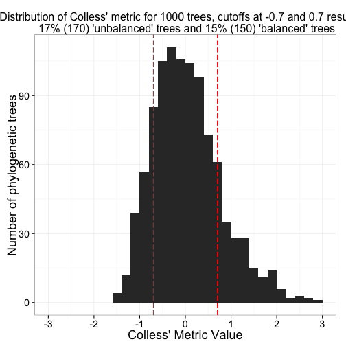
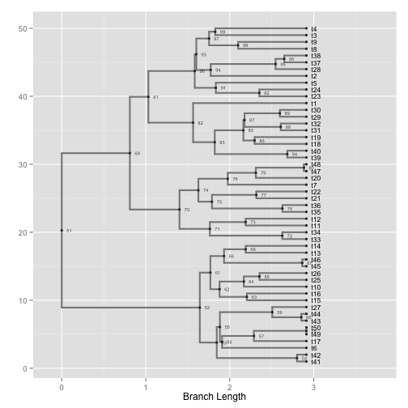
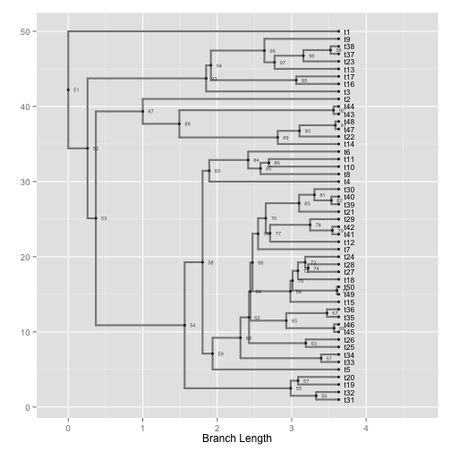
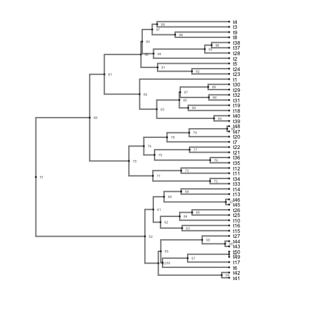
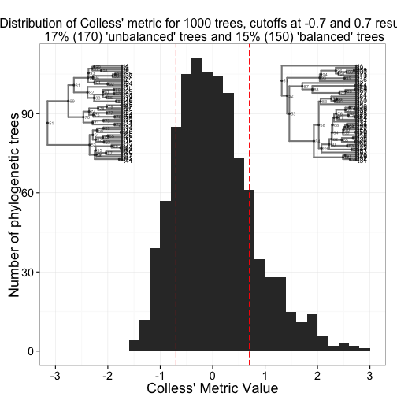

---
name: phylogenetic-tree-balance
layout: post
title: Exploring phylogenetic tree balance metrics
date: 2012-10-10
author: Scott Chamberlain
tags: 
- R
- phylogenetic
- tree shape
---

I need to simulate balanced and unbalanced phylogenetic trees for some research I am doing.  In order to do this, I do rejection sampling: simulate a tree -> measure tree shape -> reject if not balanced or unbalanced __enough__.  But what is enough?  We need to define some cutoff value to determine what will be our set of balanced and unbalanced trees. 

### A function to calculate shape metrics, and a custom theme for plottingn phylogenies.

```r
foo <- function(x, metric = "colless") {
    if (metric == "colless") {
        xx <- as.treeshape(x)  # convert to apTreeshape format
        colless(xx, "yule")  # calculate colless' metric
    } else if (metric == "gamma") {
        gammaStat(x)
    } else stop("metric should be one of colless or gamma")
}

theme_myblank <- function() {
    stopifnot(require(ggplot2))
    theme_blank <- ggplot2::theme_blank
    ggplot2::theme(panel.grid.major = element_blank(), panel.grid.minor = element_blank(), 
        panel.background = element_blank(), plot.background = element_blank(), 
        axis.title.x = element_text(colour = NA), axis.title.y = element_blank(), 
        axis.text.x = element_blank(), axis.text.y = element_blank(), axis.line = element_blank(), 
        axis.ticks = element_blank())
}
```


### Simulate some trees

```r
library(ape)
library(phytools)

numtrees <- 1000  # lets simulate 1000 trees
trees <- pbtree(n = 50, nsim = numtrees, ape = F)  # simulate 500 pure-birth trees with 100 spp each, ape = F makes it run faster
```


### Calculate Colless' shape metric on each tree

```r
library(plyr)
library(apTreeshape)

colless_df <- ldply(trees, foo, metric = "colless")  # calculate metric for each tree
head(colless_df)
```

```
         V1
1 -0.036091
2 -0.816091
3 -0.536091
4  1.643909
5  0.003909
6 -0.896091
```

```r

# Calculate the percent of trees that will fall into the cutoff for
# balanced and unbalanced trees
col_percent_low <- round(length(colless_df[colless_df$V1 < -0.7, "V1"])/numtrees, 
    2) * 100
col_percent_high <- round(length(colless_df[colless_df$V1 > 0.7, "V1"])/numtrees, 
    2) * 100
```


### Create a distribution of the metric values

```r
library(ggplot2)

a <- ggplot(colless_df, aes(V1)) +  # plot histogram of distribution of values
	geom_histogram() + 
	theme_bw(base_size=18) + 
	scale_x_continuous(limits=c(-3,3), breaks=c(-3,-2,-1,0,1,2,3)) + 
	geom_vline(xintercept = -0.7, colour="red", linetype = "longdash") +
	geom_vline(xintercept = 0.7, colour="red", linetype = "longdash") +
	ggtitle(paste0("Distribution of Colless' metric for 1000 trees, cutoffs at -0.7 and 0.7 results in\n ", col_percent_high, "% (", numtrees*(col_percent_high/100), ") 'unbalanced' trees and ", col_percent_low, "% (", numtrees*(col_percent_low/100), ") 'balanced' trees")) + 
	labs(x = "Colless' Metric Value", y = "Number of phylogenetic trees") +
	theme(plot.title  = element_text(size = 16))

a
```

 


### Create phylogenies representing balanced and unbalanced trees (using the custom theme)

```r
library(ggphylo)

b <- ggphylo(trees[which.min(colless_df$V1)]) + theme_myblank()
```

 

```r
c <- ggphylo(trees[which.max(colless_df$V1)]) + theme_myblank()
```

 

```r

b
```

 


### Now, put it all together in one plot using some gridExtra magic.

```r
library(gridExtra)

grid.newpage()
pushViewport(viewport(layout = grid.layout(1, 1)))
vpa_ <- viewport(width = 1, height = 1, x = 0.5, y = 0.49)
vpb_ <- viewport(width = 0.35, height = 0.35, x = 0.23, y = 0.7)
vpc_ <- viewport(width = 0.35, height = 0.35, x = 0.82, y = 0.7)
print(a, vp = vpa_)
print(b, vp = vpb_)
print(c, vp = vpc_)
```

 


*********
#### Get the .Rmd file used to create this post [at my github account](https://github.com/SChamberlain/schamberlain.github.com/blob/master/_drafts/2012-10-10-phylogenetic-tree-balance.Rmd) - or [.md file](https://github.com/SChamberlain/schamberlain.github.com/tree/master/_posts/2012-10-10-phylogenetic-tree-balance.md).

#### Written in [Markdown](http://daringfireball.net/projects/markdown/), with help from [knitr](http://yihui.name/knitr/).
