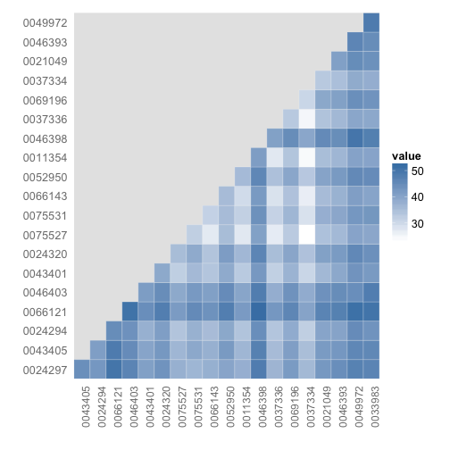

Yesterday [we wrote](http://ropensci.org/blog/oaweek-rplos-1) about a use case for accessing PLOS full text articles programmatically in R. Here is another use case. 

What if you want to find similar papers based on their text content?  This can be done using the PLOS search API, with help from the `tm` R package.

### Install rplos from CRAN


```r
install.packages(c("rplos", "tm", "wordcloud", "RColorBrewer"))
```


### Get some text


```r
library(rplos)
out <- searchplos("*:*", fields = "id,introduction", limit = 20, toquery = list("cross_published_journal_key:PLoSONE", 
    "doc_type:full"))
out$idshort <- sapply(out$id, function(x) strsplit(x, "\\.")[[1]][length(strsplit(x, 
    "\\.")[[1]])], USE.NAMES = FALSE)
```


The result is a list of length `limit` defined in the previous call. 


```r
nrow(out)
```

```
[1] 20
```


### Word dictinoaries.

Next, we'll use the tm package to create word dictionaries for each paper. 


```r
library(tm)
corpus <- Corpus(DataframeSource(out["introduction"]))

# Clean up corpus
corpus <- tm_map(corpus, function(x) removeWords(x, stopwords("english")))
corpus <- tm_map(corpus, function(x) removePunctuation(x))
tdm <- TermDocumentMatrix(corpus)
tdm$dimnames$Docs <- out$idshort

# Comparison among documents in a heatmap
dissmat <- dissimilarity(tdm, method = "Euclidean")
get_dist_frame <- function(x) {
    temp <- data.frame(subset(data.frame(expand.grid(dimnames(as.matrix(x))), 
        expand.grid(lower.tri(as.matrix(x)))), Var1.1 == "TRUE")[, -3], as.vector(x))
    names(temp) <- c("one", "two", "value")
    tempout <- temp[!temp[, 1] == temp[, 2], ]
    tempout
}
dissmatdf <- get_dist_frame(dissmat)
ggplot(dissmatdf, aes(one, two)) + geom_tile(aes(fill = value), colour = "white", 
    binwidth = 3) + scale_fill_gradient(low = "white", high = "steelblue") + 
    theme_grey(base_size = 16) + labs(x = "", y = "") + scale_x_discrete(expand = c(0, 
    0)) + scale_y_discrete(expand = c(0, 0)) + theme(axis.ticks = theme_blank(), 
    axis.text.x = element_text(size = 12, hjust = 0.6, colour = "grey50", angle = 90), 
    panel.grid.major = theme_blank(), panel.grid.minor = theme_blank(), panel.border = theme_blank())
```

 


### Determine similarity among papers

Using a wordcloud


```r
library(wordcloud)
library(RColorBrewer)

m <- as.matrix(tdm)
v <- sort(rowSums(m), decreasing = TRUE)
d <- data.frame(word = names(v), freq = v)
pal <- brewer.pal(9, "Blues")
pal <- pal[-(1:2)]

# Plot the chart
wordcloud(d$word, d$freq, scale = c(3, 0.1), min.freq = 2, max.words = 250, 
    random.order = FALSE, rot.per = 0.2, colors = pal)
```

 

