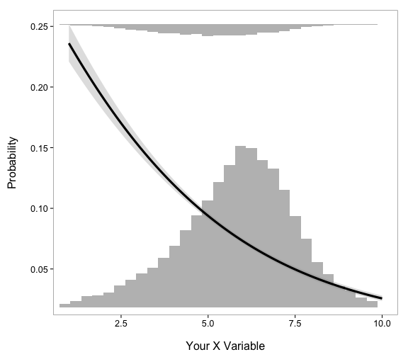

Someone asked about plotting something like this today

I [wrote a few functions previously](http://recology.info/2012/01/logistic-regression-barplot-fig/) to do something like this. However, since then `ggplot2` has changed, and one of the functions no longer works.

Hence, I fixed `opts()` to `theme()`, `theme_blank()` to `element_blank()`, and `panel.background = element_blank()` to `plot.background = element_blank()` to get the histograms to show up with the line plot and not cover it.

The new functions:


```r
loghistplot  <- function(data) {
  names(data) <- c('x','y') # rename columns

  # get min and max axis values
  min_x <- min(data$x)
  max_x <- max(data$x)
  min_y <- min(data$y)
  max_y <- max(data$y)

  # get bin numbers
  bin_no <- max(hist(data$x, plot = FALSE)$counts) + 5

  # create plots
  a <- ggplot(data, aes(x = x, y = y)) +
    theme_bw(base_size=16) +
    geom_smooth(method = "glm", family = "binomial", se = TRUE,
                colour='black', size=1.5, alpha = 0.3) +
    scale_x_continuous(limits=c(min_x,max_x)) +
    theme(panel.grid.major = element_blank(),
          panel.grid.minor=element_blank(),
          panel.background = element_blank(),
          plot.background = element_blank()) +
    labs(y = "Probability\n", x = "\nYour X Variable")

  theme_loghist <- list(
    theme(panel.grid.major = element_blank(),
          panel.grid.minor=element_blank(),
          axis.text.y = element_blank(),
          axis.text.x = element_blank(),
          axis.ticks = element_blank(),
          panel.border = element_blank(),
          panel.background = element_blank(),
          plot.background = element_blank())
  )

  b <-
  ggplot(data[data$y == unique(data$y)[1], ], aes(x = x)) +
    theme_bw(base_size=16) +
    geom_histogram(fill = "grey") +
    scale_y_continuous(limits=c(0,bin_no)) +
    scale_x_continuous(limits=c(min_x,max_x)) +
    theme_loghist +
    labs(y='\n', x='\n')

  c <- ggplot(data[data$y == unique(data$y)[2], ], aes(x = x)) +
    theme_bw(base_size=16) +
    geom_histogram(fill = "grey") +
    scale_y_continuous(trans='reverse', limits=c(bin_no,0)) +
    scale_x_continuous(limits=c(min_x,max_x)) +
    theme_loghist +
    labs(y='\n', x='\n')

  grid.newpage()
  pushViewport(viewport(layout = grid.layout(1,1)))

  vpa_ <- viewport(width = 1, height = 1, x = 0.5, y = 0.5)
  vpb_ <- viewport(width = 1, height = 1, x = 0.5, y = 0.5)
  vpc_ <- viewport(width = 1, height = 1, x = 0.5, y = 0.5)

  print(b, vp = vpb_)
  print(c, vp = vpc_)
  print(a, vp = vpa_)
}
```


```r
logpointplot  <- function(data) {
  names(data) <- c('x','y') # rename columns

  # get min and max axis values
  min_x <- min(data$x)
  max_x <- max(data$x)
  min_y <- min(data$y)
  max_y <- max(data$y)

  # create plots
  ggplot(data, aes(x = x, y = y)) +
    theme_bw(base_size=16) +
    geom_point(size = 3, alpha = 0.5, position = position_jitter(w=0, h=0.02)) +
    geom_smooth(method = "glm", family = "binomial", se = TRUE,
                colour='black', size=1.5, alpha = 0.3) +
    scale_x_continuous(limits=c(min_x,max_x)) +
    theme(panel.grid.major = element_blank(),
          panel.grid.minor=element_blank(),
          panel.background = element_blank()) +
    labs(y = "Probability\n", x = "\nYour X Variable")

}
```

Install `ggplot2` and `gridExtra` if you don't have them:


```r
install.packages(c("ggplot2","gridExtra"), repos = "http://cran.rstudio.com")
```

And their use:

__Logistic histogram plots__


```r
loghistplot(data=mtcars[,c("mpg","vs")])
```

 


```r
loghistplot(movies[,c("rating","Action")])
```

 


__Logistic point plots__


```r
loghistplot(data=mtcars[,c("mpg","vs")])
```

 


```r
loghistplot(movies[,c("rating","Action")])
```

 
